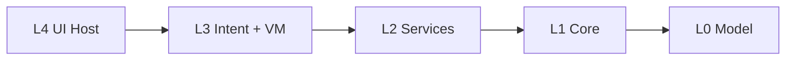

# harmony-app architecture

## TL;DR

The HarmonyOS port of Readmigo (CN edition) runs on a **4-layer L1–L4
architecture** wrapped around **4 pillars**: a Distributed Reading Soul that
syncs reading state across the super-device fleet, an Adaptive Surface
Decomposition that lets one ViewModel render across 5 device classes, an
Atomic Service Surface for micro-interactions, and an AI Reading Co-Pilot
injected as a cross-cutting L2 aspect. Layer rules are machine-checked at
build time by `scripts/check-import-boundary.mjs`; the full rule set lives
in `docs/architecture/layer-contract.md`.

---

## 1. The 4 layers



### Layer responsibility table

| Layer | Example dirs | Allowed APIs | Forbidden APIs |
|---|---|---|---|
| **L4** | `features/*/pages/`, `features/*/components/`, `features/*/surfaces/`, `ui/` | `@ohos.arkui.*`; publishes Intents via `core/intent/`; reads VM state | direct HTTP, direct `@ohos.data.distributedDataObject`, sibling-surface imports |
| **L3** | `features/*/intent/`, `features/*/viewmodel/` | Intent declarations + `FeatureViewModel<S>`; calls L2 services | `@ohos.arkui.*` runtime (only `import type` allowed); cross-feature imports |
| **L2** | `api/`, `store/`, `features/*/service/` | HTTP, persistence, store mutations, business logic | `@ohos.arkui.*` (any form) |
| **L1** | `core/distributed-soul/`, `core/intent/`, `core/surface/`, `core/theme/`, `core/router/`, `core/shell/`, `core/widget/`, `core/native/`, … | Cross-cutting platform capability; composition root | reaching into L2/L3/L4 except for the 6 enumerated composition exceptions |
| **L0** | `model/` | Pure DTOs (aligned with `server-cn`) | any runtime side-effect |

The full RULE-IDs (`RULE-L1-no-arkui`, `RULE-L1-Soul-exclusive`,
`RULE-no-feature-cross`, …) and the dir-by-dir exception list live in
`docs/architecture/layer-contract.md`.

---

## 2. The 4 pillars

### 2.1 Distributed Reading Soul

The Reading Soul is a cross-device LWW state propagator built on
`@ohos.data.distributedDataObject`. It owns reading position, chapter
metadata, optimistic text selection, and device-presence — all keyed by
session and resolved via Lamport timestamps. A LocalFallback path keeps
callers branch-free when the distributed API is unavailable (emulator,
older firmware). **Only** `core/distributed-soul/*` may import the
distributed data API. Deep dive: `docs/distributed-soul.md`.

### 2.2 Adaptive Surface Decomposition

Each feature exposes a single ViewModel (state machine) and up to 5
SurfaceKind renderers: Phone, Tablet (incl. 2-in-1), Watch, Car, TV. At
runtime, `SurfaceContext` resolves the active SurfaceKind from device
class + fold state + window breakpoint + user override, and
`SurfaceRegistry` dispatches state to the matching renderer. The
`core/surface/Surface.ets` `@Component` is the sole ArkUI host in L1.
ViewModels never branch on SurfaceKind. Deep dive:
`docs/surface-decomposition.md`.

### 2.3 Atomic Service Surface

Micro-interactions (word lookup, share-card render, "continue reading"
deep link) ship as independent UIAbility / 元服务 packages, separate from
the entry HAP and constrained to ≤ 10 MB per HarmonyOS store rules. Each
atomic service is its own process with its own IntentBus instance;
state arriving via Continuation re-stamps `intent.source` to the receiving
device's SurfaceKind. Packaging boundaries: `docs/bundle-strategy.md` §2
(`atomic` row) and §5.

### 2.4 AI Reading Co-Pilot

The Co-Pilot is exposed as an **LLM Adapter** in L2 (under `api/ai/`),
cross-cuts the reader/vocab/audiobook features, and is invoked through
the existing `CROSS_FEATURE_ALLOW` edges (`reader → ai-tools`,
`vocab → ai-tools`). It is not a layer of its own; it is a service that
features depend on via Intents (`reader.lookupWord`, future `copilot.*`).
Token, prompt cache, and rate-limit policy live alongside `api/client/`.

---

## 3. Compatibility with the pre-W1 layout

W1 is **additive**: no existing directory is renamed or removed. The
existing 16 feature dirs (account, admin, ai-tools, audiobook, dev,
discover, library, multi-device, multi-platform, notes, notification,
reader, study, support, vocab, plus the future widget HAR) keep their
positions. W1 adds:

- `core/distributed-soul/`, `core/intent/`, `core/surface/` (L1 platform
  capabilities).
- Per-feature `intent/` and `viewmodel/` sub-folders under each feature
  that opts into the new contract (W1 scope: reader, discover, library,
  account, audiobook).

Existing `CROSS_FEATURE_ALLOW` edges
(`reader→{ai-tools,audiobook,multi-device}`, `vocab→{…}`,
`multi-platform→{ai-tools,notes}`, `multi-device→{notes,multi-platform}`)
are preserved verbatim in
`scripts/check-import-boundary.mjs:CROSS_FEATURE_ALLOW`.

---

## 4. Migration from "hybrid feature-first"

The pre-W1 doc described a **hybrid feature-first** model with rules per
top-level dir (`features/`, `core/`, `api/`, `store/`, `ui/`, `model/`).
W1 keeps every one of those rules and **adds two finer dimensions**:

1. Each feature is internally split into **L2 service / L3 intent+VM /
   L4 UI** sub-folders, with ArkUI imports walled off from L2 and L3.
2. Three new L1 sub-modules (`distributed-soul`, `intent`, `surface`)
   gain exclusive ownership of specific APIs.

There is no rename, no churn, no breaking change for the 11 pre-existing
features outside the W1 scope; they continue to compile against the old
rules until they migrate (the boundary checker treats them as
"intent/viewmodel sub-folder absent" → no new constraint).

---

## 5. Build-time enforcement

`scripts/check-import-boundary.mjs` runs in the `hvigor` pre-build step.
It encodes every layer rule in `docs/architecture/layer-contract.md` and
every W1 addition above. Violation lines look like:

```
VIOLATION [W1] features/reader/viewmodel/ReaderViewModel.ets:42: W1-2: L3 feature intent/viewmodel must not import @ohos.arkui.* (use `import type` only)
```

The leading tag (`[W1]`, `[features/]`, …) maps to a section in the layer
contract. CI fails on any violation; there is no bypass flag.

Local check:

```
node harmony-app/scripts/check-import-boundary.mjs
```

---

## 6. Adding a new feature

The 1-page checklist lives in `docs/architecture/feature-template.md`.
TL;DR: create `intent/`, `viewmodel/`, `service/`, `pages/`, optional
`surfaces/`, write a barrel, register the route, run the boundary check.

---

## 7. Related documents

| Topic | Doc |
|---|---|
| Layer rules (machine-checkable) | `docs/architecture/layer-contract.md` |
| Intent / IntentBus / ViewModel base | `docs/architecture/intent-contract.md` |
| Per-feature scaffolding checklist | `docs/architecture/feature-template.md` |
| Distributed Reading Soul deep dive | `docs/distributed-soul.md` |
| Surface decomposition deep dive | `docs/surface-decomposition.md` |
| HSP/HAR bundle split | `docs/bundle-strategy.md` |
| Performance & memory budgets | `docs/performance-budget.md` |
| Historical hybrid-feature-first design | `docs/specs/2026-05-17-harmony-app-feature-first-design.md` |
| Historical implementation plan | `docs/specs/2026-05-17-harmony-app-feature-first-impl-plan.md` |
