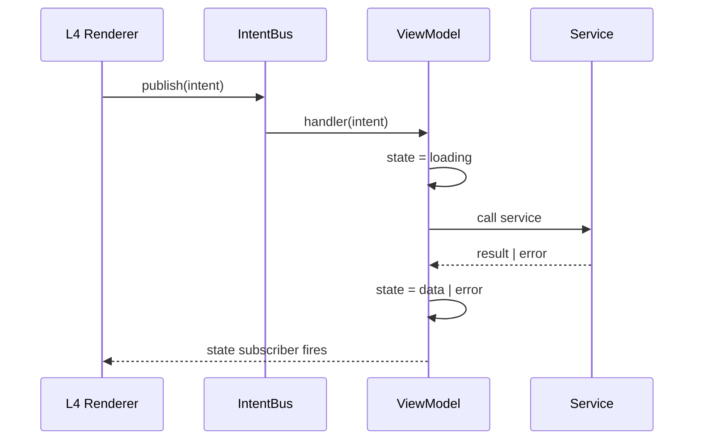

# Intent Contract — Readmigo HarmonyOS (W1)

> Specification for `core/intent/` (L1). Defines the **shape**, **lifecycle**,
> and **routing** of Intents in the L4 → L3 path. Every feature ViewModel and
> every L4 renderer implements against this contract.

---

## 0. TL;DR

An **Intent** is an immutable, discriminated-union event carrying a single
user action (`OpenBook`, `SelectText`, `JumpToPage`, …). L4 renderers
**publish** intents to the **IntentBus**; L3 ViewModels **subscribe** to the
intent kinds they own; L2 services do the actual work and feed back through
the ViewModel's `state` envelope. **No** renderer mutates state directly,
and **no** ViewModel imports ArkUI runtime — see
`docs/architecture/layer-contract.md`.

---

## 1. Intent shape

```ets
interface Intent<K extends string, P> {
  readonly kind: K;
  readonly payload: P;
  readonly idempotencyKey: string;
  readonly source: SurfaceKind;
  readonly tsMs: number;
}
```

| Field | Type | Required | Notes |
|---|---|---|---|
| `kind` | string literal | yes | Discriminator (e.g. `'reader.openBook'`); see §6 for the W1 roster |
| `payload` | feature-defined | yes | Plain object, **must be JSON-serializable**; no functions / class instances |
| `idempotencyKey` | string | yes | Globally unique within a 1-second window (see §4) |
| `source` | `SurfaceKind` | yes | `Phone | Tablet | Watch | Car | TV` — which renderer fired it |
| `tsMs` | number | yes | `Date.now()` at publish; used for ordering + tracing |

### 1.1 Discriminated union

Intents are typed as a discriminated union per feature. Type narrowing in
handlers happens via the `kind` discriminator:

```ets
type ReaderIntent =
  | Intent<'reader.openBook',      { bookId: string }>
  | Intent<'reader.jumpToChapter', { chapterId: string }>
  | Intent<'reader.jumpToPage',    { pageIdx: number }>
  ;
```

### 1.2 Naming

- `kind` must be `<feature>.<verb>` in **camelCase** (`reader.openBook`, not
  `READER_OPEN_BOOK`).
- Verb is **imperative present tense** (`openBook`, not `openedBook` /
  `bookOpened`). Intents describe **user requests**, not facts.
- The dotted form is human-readable in logs and lets the bus route by
  prefix when needed (`kind.startsWith('reader.')`).

### 1.3 Immutability

Intents are frozen at construction (`Object.freeze`). Mutating an intent
after `publish()` is undefined behaviour — see `RULE-no-mutation` in
`feature-template.md` §5.

---

## 2. IntentBus

```ets
interface IntentBus {
  publish<I extends Intent<string, unknown>>(intent: I): Promise<void>;
  subscribe<K extends string>(
    kind: K,
    handler: (intent: Intent<K, unknown>) => Promise<void>,
  ): Unsubscribe;
}
type Unsubscribe = () => void;
```

### 2.1 Semantics

- `publish` resolves once **every** matching subscriber has either started
  handling (fire-and-forget) or rejected. It does not wait for handler
  completion — see §3.
- `subscribe` returns an unsubscribe function. The bus does **not** hold
  strong references that would block GC of a `FeatureViewModel`; the
  unsubscribe must be called from `onDestroy`.
- Multiple subscribers per `kind` are allowed (e.g. an analytics tap). The
  bus calls them sequentially; one throwing does not block the others.
- Subscriptions are scoped per-process. Atomic services (`UIAbility`)
  running in a separate process have an independent IntentBus instance.

### 2.2 Concrete

The reference implementation lives at
`core/intent/IntentBus.ets` (L1). It is a singleton (`IntentBus.getInstance()`)
to keep the renderer call site call-free of DI plumbing.

---

## 3. Lifecycle



### 3.1 Steps

1. Renderer constructs an `Intent` and calls `IntentBus.publish(intent)`.
2. Bus looks up handlers for `intent.kind` in **registration order** and
   awaits each (handlers must be non-blocking; see §3.2).
3. ViewModel handler narrows by `kind` and updates `state` (see §5).
4. State subscribers (the renderer's `@State` / observer hookup) fire and
   ArkUI re-renders.

### 3.2 Async expectations

- Handlers **must return a Promise within 1 frame (≈16ms)**. Long work goes
  into the L2 service; the handler sets `state.status = 'loading'` and
  awaits the service asynchronously.
- Handlers **must not** throw synchronously. Errors flow through the state
  envelope (`status: 'error'`).
- Renderers **must not** `await` `publish()` to gate UI. The await is for
  back-pressure only; UI updates happen via state subscribers.

---

## 4. Idempotency

### 4.1 Rule

If the bus sees two intents with the **same `idempotencyKey`** within
**1000 ms**, the second is **dropped** (handler is not invoked).

### 4.2 Key construction

| Use case | Recommended key |
|---|---|
| Button tap | `${surfaceId}:${kind}:${tsMs}` (collision-free per source) |
| Gesture (swipe page) | `${surfaceId}:${kind}:${pageIdx}` (dedup rapid double-fire) |
| Resume from continuation | `continuation:${sessionId}:${kind}` (let the second resume win after 1s) |

### 4.3 Why 1s

Frame jitter + multi-touch can fire the same logical tap twice within
≤200 ms. 1 s is a generous-but-safe ceiling; longer would suppress
intentional repeated actions (e.g. tapping "next page" twice in a row).

### 4.4 Out of scope

Cross-device idempotency (the same intent emitted on phone and tablet) is
**not** handled by the bus. Cross-device deduplication is the
DistributedSoul's job — see `docs/distributed-soul.md` §3.

---

## 5. State envelope

Every ViewModel exposes its state as:

```ets
type State<T> =
  | { status: 'idle' }
  | { status: 'loading' }
  | { status: 'data';  data: T }
  | { status: 'error'; error: { code: string; message: string } };
```

| Status | Renderer should show |
|---|---|
| `idle` | initial placeholder (or skeleton if known-coming) |
| `loading` | skeleton / spinner; **never** consume `data` |
| `data` | the happy path |
| `error` | error UI; offer retry that emits the original intent |

The envelope is **not** allowed to carry partial data + error together; if
your service returns "stale data plus error", encode it as
`{ status: 'data', data: { fresh: false, value, lastError } }` inside the
feature-specific `T`.

---

## 6. W1 Intent roster

The 5 features in scope for W1 declare these intents. Payload shapes live
in each feature's `intent/` directory; the `kind` strings below are the
ground truth.

| Feature | kind | payload |
|---|---|---|
| reader | `reader.openBook` | `{ bookId: string }` |
| reader | `reader.jumpToChapter` | `{ chapterId: string }` |
| reader | `reader.jumpToPage` | `{ pageIdx: number }` |
| reader | `reader.selectText` | `{ range: TextRange }` |
| reader | `reader.openHighlightLayer` | `{ }` |
| reader | `reader.openTocSheet` | `{ }` |
| reader | `reader.openSettings` | `{ }` |
| reader | `reader.lookupWord` | `{ word: string; ctxSentence?: string }` |
| discover | `discover.browse` | `{ tab?: string }` |
| library | `library.openBookshelf` | `{ }` |
| account | `account.open` | `{ }` |
| account | `account.openSubscriptions` | `{ }` |
| audiobook | `audiobook.play` | `{ bookId: string; chapterId?: string }` |
| audiobook | `audiobook.pause` | `{ }` |

Cross-cutting (`copilot.*`, `share.*`, `continueReading.*`) intents land in
W2 and are reserved.

---

## 7. SurfaceKind & routing

```ets
enum SurfaceKind { Phone = 'phone', Tablet = 'tablet', Watch = 'watch', Car = 'car', Tv = 'tv' }
```

- `intent.source` is **set by the IntentBus at publish time** from the
  currently-active `SurfaceContext`. Renderers do **not** stamp it
  themselves (no `source: SurfaceKind.Phone` literal in renderer code).
- ViewModels **must not** branch on `intent.source` for business logic.
  Surface-specific rendering is handled by SurfaceRegistry choosing a
  different renderer; the ViewModel stays renderer-agnostic.
- Analytics / telemetry **may** read `intent.source` (it is the entire
  reason the field exists).

### 7.1 Cross-process source attribution

For intents that arrive via `Continuation` (atomic service launch on a
sibling device), the receiving process re-stamps `source` to its **own**
SurfaceContext before publishing internally. The original-device value is
preserved on the `DistributedSoul`, not on the Intent.

---

## 8. Backpressure

### 8.1 Unregistered-kind queue

If `publish(intent)` is called for a `kind` with **no current subscribers**,
the bus enqueues it (FIFO, max **N = 32**) and replays the queue when a
subscriber registers. Beyond 32, the **oldest** is dropped and a warning
logged.

| Property | Value |
|---|---|
| Queue capacity per kind | 32 |
| Eviction policy | FIFO drop-oldest |
| Drop telemetry | `intentbus.queue_overflow` counter |
| Replay timing | synchronous at subscribe |

### 8.2 Why 32

Empirically: a cold-launched ReaderAbility may receive 2–6 intents queued
by the platform (continuation, deep-link, widget tap) before its ViewModel
finishes constructing. 32 is generous and well under any memory concern.

### 8.3 Why this is allowed

Renderers are not expected to know whether their target ViewModel is yet
mounted (e.g. tab not yet activated, atomic service warming up). Queueing
avoids forcing every emitter to write `if (vmReady) publish()`.

---

## 9. ViewModel base class

```ets
abstract class FeatureViewModel<S> {
  @State protected state: State<S> = { status: 'idle' };
  protected abstract handle(intent: Intent<string, unknown>): Promise<void>;

  constructor(kinds: ReadonlyArray<string>) {
    for (const k of kinds) {
      this.subs.push(IntentBus.getInstance().subscribe(k, (i) => this.handle(i)));
    }
  }
  onDestroy(): void { this.subs.forEach(u => u()); }

  private subs: Unsubscribe[] = [];
}
```

### 9.1 What the base provides

- Sub-management: tear-down on `onDestroy`.
- State envelope storage with `@State` so renderers can observe via the
  usual ArkUI subscription path.
- A single `handle(intent)` choke-point so logging / telemetry can be
  inserted in one place.

### 9.2 What the base does **not** provide

- It does **not** import ArkUI runtime. `@State` is the only ArkUI symbol
  permitted (and it is `import type` in L3 — at the time of writing the
  ArkTS compiler treats `@State` as a decorator that survives type-erasure;
  if that changes, this base moves to L1 `core/intent/`).
- It does **not** dispatch to services; subclasses do.
- It does **not** know about `SurfaceKind`. **Why ViewModels are
  surface-blind:** if the VM branches on surface, the SurfaceRegistry's
  job (pick the right renderer) gets duplicated and the two diverge. The
  rule is: VM owns *what*; SurfaceRegistry owns *how*.

---

## 10. Forbidden patterns

| Pattern | Why forbidden | Correct |
|---|---|---|
| `IntentBus.publish(intent); intent.payload.foo = 'x'` | Mutation after publish; subscribers see a race | Build a new intent |
| `if (intent.source === Phone) doX else doY` in VM | Surface branching in L3 | Different surfaces → different L4 renderers; one VM |
| `await IntentBus.publish(...)` then read state synchronously | State updates land asynchronously via subscribers | Re-render via `@State`, not via the publish return |
| `intent.kind = 'reader.openBook'` (string literal at call site) | Bypasses the discriminated-union type narrowing | Use the typed factory `ReaderIntents.openBook(bookId)` |
| Importing `@ohos.arkui.router` inside a VM | Routing is an Intent | Emit `nav.*` intent; router subscribes |

---

## 11. Observability

The IntentBus emits two debug-only hooks (no-op in release):

- `IntentBus.onPublish((intent) => …)` — every publish (post-dedup).
- `IntentBus.onDrop((intent, reason) => …)` — every drop (`'idempotent'`,
  `'queue_overflow'`).

These feed the dev-menu intent-trace panel and are stripped at release
build (`#if !PRODUCT_RELEASE` equivalent inside `core/dev/`).

---

## 12. Where to read next

- `docs/architecture/layer-contract.md` — which dirs may import what.
- `docs/architecture/feature-template.md` — concrete checklist for wiring
  a feature against this contract.
- `docs/surface-decomposition.md` §3 — Renderer Contract (the publisher
  side of IntentBus).
- `docs/distributed-soul.md` §3 — why cross-device idempotency lives in
  Soul, not in IntentBus.
