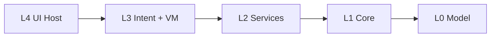

# Layer Contract — Readmigo HarmonyOS (W1)

> Machine-checkable layering rules. This document is the **specification** for
> `harmony-app/scripts/check-import-boundary.mjs`; every RULE below has a
> corresponding check in the script. If a rule is added here it must be
> implemented in the script in the same PR, and vice versa.

---

## 0. TL;DR

The HarmonyOS app is partitioned into **4 layers (L1–L4)** plus a **model bag (L0)**.
Imports may go **downward only** (L4 → L3 → L2 → L1 → L0) with the explicit
exceptions listed in §6. Each rule below has a `RULE-Lx-Ly-name` ID that the
boundary checker emits in violation messages, so a failing CI line points
directly to the spec section to read.

---

## 1. Layer roster

| Layer | Directory roots | Purpose | ArkUI allowed? | Network allowed? |
|---|---|---|---|---|
| **L0** | `model/` | Pure DTO / discriminated unions, aligned with `server-cn` | no | no |
| **L1** | `core/` (incl. `core/distributed-soul/`, `core/intent/`, `core/surface/`, `core/theme/`, `core/router/`, `core/shell/`, `core/widget/`, `core/experiments/`, `core/native/`, …) | Cross-cutting platform capabilities, composition root, distributed soul, intent bus, surface registry | only in 4 enumerated dirs (§3) | only via `core/native/*` |
| **L2** | `api/`, `store/`, `features/*/service/` | HTTP clients, reactive global stores, per-feature domain services | **no** | yes (HTTP / persistence) |
| **L3** | `features/*/intent/`, `features/*/viewmodel/` | Intent definitions + ViewModels (state machine + intent handling) | `import type` only | through L2 only |
| **L4** | `features/*/pages/`, `features/*/components/`, `features/*/surfaces/`, `features/*/adapters/`, `ui/` | ArkUI hosts; the only layer that may freely `import { … } from '@ohos.arkui.*'` | **yes (host)** | through L3/L2 only |

> `features/<X>/` is **split across L2/L3/L4** by sub-directory. The split is
> by sub-path, not by file extension — see RULE-no-upward in §5 for the exact
> mapping.

### 1.1 Layer diagram



| Layer | Example file |
|---|---|
| L4 | `features/reader/pages/ReaderPage.ets` |
| L3 | `features/reader/viewmodel/ReaderViewModel.ets` |
| L2 | `features/reader/service/ReaderService.ets`, `api/books/BooksApi.ets`, `store/ReadingStore.ets` |
| L1 | `core/intent/IntentBus.ets`, `core/distributed-soul/SoulEngine.ets` |
| L0 | `model/Book.ets` |

---

## 2. Reserved L1 sub-modules (W1 additions)

The following `core/*` sub-directories are **W1-introduced** and have
dedicated rules. They co-exist with the pre-W1 sub-modules and must not be
moved out of L1.

| Sub-module | Sole responsibility | Sole import privilege |
|---|---|---|
| `core/distributed-soul/` | Cross-device LWW state propagation | **only** caller of `@ohos.data.distributedDataObject` |
| `core/intent/` | Intent / IntentBus / FeatureViewModel base | none extra |
| `core/surface/` | SurfaceKind / SurfaceContext / SurfaceRegistry / single `Surface` ArkUI component | may import `@ohos.arkui.*` (only L1 dir besides `core/shell/`, `core/widget/`, `core/theme/` that may) |

Adding new files inside these directories does not require a contract change.
**Splitting their responsibilities into other dirs requires a contract update.**

---

## 3. ArkUI containment rules

`@ohos.arkui.*` (component decorators, builders, `@Component`, `@Builder`,
`Stack`, `Column`, `Text`, …) **must not leak outside the rendering host**.
The hard rules:

### `RULE-L1-no-arkui`

**Rule:** L1 (`core/**`) may not `import` from `@ohos.arkui.*` except in these
four files / directories:

| Allowed L1 path | Reason |
|---|---|
| `core/surface/Surface.ets` | Sole `@Component` that switches renderer per `SurfaceKind` |
| `core/theme/**` | Token primitives consumed by every ArkUI page |
| `core/widget/**` | FormExtensionAbility ships its own ArkUI tree (`@Form…`) |
| `core/shell/**` | App composition root (`Index.ets` shell) |

- **Positive (allowed):** `core/surface/Surface.ets` imports `@Component` from `@ohos.arkui.component`.
- **Negative (rejected):** `core/intent/IntentBus.ets` importing `Text` from `@ohos.arkui.*`.

**Why:** L1 is platform capability; mixing UI primitives makes it impossible
to unit-test L1 without DevEco and prevents reuse from FormExtensionAbility
(widget) where the ArkUI surface differs.

### `RULE-L2-no-arkui`

**Rule:** L2 (`api/`, `store/`, `features/*/service/`) **must not** import
from `@ohos.arkui.*` — **no exceptions**, not even `import type`.

- **Positive (allowed):** `features/reader/service/ReaderService.ets` imports `HttpClient` from `api/client/`.
- **Negative (rejected):** `store/ReadingStore.ets` importing `@State` from `@ohos.arkui.*`.

**Why:** Services and stores are headless. They must execute under
`@ohos.HSP` cold-load, FormExtensionAbility, and `ohosTest` without an ArkUI
runtime.

### `RULE-L3-no-arkui-runtime`

**Rule:** L3 (`features/*/intent/`, `features/*/viewmodel/`) may use
`import type { … } from '@ohos.arkui.*'` for type-only references (e.g.
`type Builder`); runtime imports are rejected.

- **Positive (allowed):** `features/reader/viewmodel/ReaderViewModel.ets`:
  `import type { Builder } from '@ohos.arkui.component'`.
- **Negative (rejected):** the same file calling `router.pushUrl(…)`.

**Why:** ViewModels must remain renderer-agnostic so all 5 SurfaceKinds
share one VM. Routing is signalled via Intents, not ArkUI calls.

> Implemented in `scripts/check-import-boundary.mjs` as `W1-2`.

### `RULE-L4-only-arkui-host`

**Rule:** L4 (`features/*/pages/`, `features/*/components/`,
`features/*/surfaces/`, `features/*/adapters/`, `ui/`) is the **only** layer
that may freely `import` runtime ArkUI symbols.

- **Positive (allowed):** `features/reader/pages/ReaderPage.ets` declaring a `@Component struct`.
- **Negative (rejected):** putting that struct in `features/reader/service/`.

**Why:** Concentrating ArkUI to a single layer makes surface decomposition
(see `docs/surface-decomposition.md`) and the bundle split
(`docs/bundle-strategy.md`) trivially mappable.

---

## 4. Distributed-Soul exclusivity

### `RULE-L1-Soul-exclusive`

**Rule:** **Only** files under `core/distributed-soul/` may `import` from
`@ohos.data.distributedDataObject`.

- **Positive (allowed):** `core/distributed-soul/SoulEngine.ets` calling
  `distributedDataObject.create(…)`.
- **Negative (rejected):** `features/reader/service/ReaderService.ets`
  importing `distributedDataObject` to "sync directly".

**Why:** The distributed soul owns Lamport timestamping, LWW resolution,
fallback mode, and payload budget. A second caller would split conflict
resolution and silently corrupt the cross-device state described in
`docs/distributed-soul.md`.

> Implemented in `scripts/check-import-boundary.mjs` as `W1-1`.

---

## 5. Layer ordering

### `RULE-no-upward`

**Rule:** Layer N may not import from any layer M where M > N. Mapping of
`features/<X>/` sub-paths to layers:

| Sub-path under `features/<X>/` | Layer |
|---|---|
| `service/`, `repository/` | L2 |
| `intent/`, `viewmodel/`, `vm/` | L3 |
| `pages/`, `components/`, `surfaces/`, `adapters/` | L4 |

- **Positive:** `features/reader/viewmodel/ReaderViewModel.ets` imports
  `features/reader/service/ReaderService.ets` (L3 → L2). OK.
- **Negative:** `features/reader/service/ReaderService.ets` imports
  `features/reader/pages/ReaderPage.ets` (L2 → L4). Rejected.

### `RULE-no-feature-cross`

**Rule:** `features/X/**` may not import from `features/Y/**`. Cross-feature
collaboration goes through `store/` (shared reactive state) or `api/`
(shared domain endpoint). Historical exceptions are preserved verbatim in
`CROSS_FEATURE_ALLOW` inside `scripts/check-import-boundary.mjs`:

| From | May import from |
|---|---|
| `reader` | `ai-tools`, `audiobook`, `multi-device` |
| `vocab` | `ai-tools`, `audiobook`, `multi-device` |
| `multi-platform` | `ai-tools`, `notes` |
| `multi-device` | `notes`, `multi-platform` |

New entries here require a docs PR + an `arkts-dep-check` follow-up
(W22 — see `docs/bundle-strategy.md` §5).

- **Positive:** `features/reader/service/ReaderService.ets` imports
  `store/ReadingStore.ets`.
- **Negative:** `features/library/pages/LibraryPage.ets` imports
  `features/account/pages/AccountPage.ets`.

---

## 6. Composition-root exceptions

Some L1 dirs are explicitly allowed to reach L2/L3/L4 because they **are**
the composition root or run inside a separate runtime entity (Widget
ExtensionAbility). These are preserved from the pre-W1 boundary script and
must remain narrow:

| Source path | Allowed imports | Why |
|---|---|---|
| `core/shell/` | `features/**`, `ui/**`, `store/**`, `api/**` | `Index.ets` composes everything |
| `core/widget/` | `api/**`, `store/**`, `features/**` | FormExtensionAbility is its own process |
| `core/router/` | `store/**` | `RouteGuard` reads `UserStore` for auth |
| `core/theme/` | `store/**` | `ThemeService` persists user preference |
| `core/experiments/` | `store/**` | Reads user group |
| `api/client/` | `store/**` | HTTP interceptor reads token |

**W1 additions** (allow-list, but with **no** new outward edges):

| Source path | Allowed outward imports |
|---|---|
| `core/distributed-soul/` | — (none extra; only privileged API is `@ohos.data.distributedDataObject`) |
| `core/intent/` | — |
| `core/surface/` | — (privileged API is `@ohos.arkui.*` and may consume `core/intent`, `core/distributed-soul` — same L1, OK) |

If a new exception is needed, propose it in this section first and have it
land in the boundary script in the same PR.

---

## 7. Fan-out ceiling

### `RULE-fanout-13`

**Rule:** A single `.ets` file may not contain more than **13** project-local
import statements (i.e. `from '../…'` or `from '@/…'`; `@ohos.*` does not
count). Inherits the L3 ceiling validated on iOS.

- **Positive:** a typical ViewModel imports 4–8 modules.
- **Negative:** a "god" page importing 18 components from across 4 features.

**Why:** Fan-out > 13 empirically correlates with files that are too big to
load lazily and break the bundle budget in
`docs/performance-budget.md`. When you hit the ceiling, split the file or
move shared imports into a barrel (`index.ets`).

---

## 8. Verification

### 8.1 CI gate

`scripts/check-import-boundary.mjs` runs in the `hvigor` pre-build step. A
violation prints:

```
VIOLATION [W1] features/reader/viewmodel/ReaderViewModel.ets:42: W1-2: L3 feature intent/viewmodel must not import @ohos.arkui.* (use `import type` only)
  import { router } from '@ohos.arkui.router';
```

The leading `[W1]` / `[features/]` etc. corresponds to the rule families in
this document.

### 8.2 Local

```
node harmony-app/scripts/check-import-boundary.mjs
```

Exits non-zero on any violation. No flag bypasses the check; if a rule needs
to change, change it here and in the script in the same PR.

### 8.3 What the checker does **not** enforce

- `RULE-fanout-13` is currently advisory; the count is logged but does not
  fail CI until W22.
- `import type` detection is **string-prefix** based (`startsWith('import type')`).
  Mixed-form imports (`import {type T, fn} from …`) currently fall back to
  the runtime-import rule. Prefer the `import type { … } from …` form in L3.

---

## 10. Fanout audit (auto-generated)

> Generated by W5 refactor pass. Files with > 10 project-local imports are listed.
> Ceiling is 13 (RULE-fanout-13, advisory until W22). Status: ok = ≤10, near-limit = 11–13, over = >13.

| File | Fanout | Status |
|---|---|---|
| `features/reader/pages/Reader.ets` | 30 | over |
| `entryability/EntryAbility.ets` | 27 | over |
| `core/shell/Index.ets` | 22 | over |
| `features/audiobook/pages/AudiobookPlayer.ets` | 11 | near-limit |
| `features/audiobook/pages/AudiobookTab.ets` | 11 | near-limit |
| `features/library/pages/Library.ets` | 11 | near-limit |
| `features/multi-platform/pages/atomic/LookupPage.ets` | 11 | near-limit |
| `features/stats/pages/StatsPageAdapter.ets` | 11 | near-limit |

**Notes:**
- All `over` files are in L4 (ArkUI host layer) or composition-root (`core/shell/`, `entryability/`). These are expected to have higher fanout; W22 enforcement will add targeted exceptions for composition roots.
- All ViewModel files (`features/*/viewmodel/*.ets`) are at or below 11. `ReaderViewModel` was reduced from 14 → 9 by the W5 split into `ReaderLookupViewModel` (5) and `ReaderProgressViewModel` (8).
- `features/reader/pages/Reader.ets` at fanout 30 is the primary non-composition-root candidate for a follow-up split in W6+.

---

## 9. Where to read next

- `docs/architecture/intent-contract.md` — Intent shape, IntentBus contract,
  ViewModel base class.
- `docs/architecture/feature-template.md` — numbered checklist for adding a
  feature without violating these rules.
- `docs/distributed-soul.md` — why `core/distributed-soul/` has exclusive
  access to `distributedDataObject`.
- `docs/surface-decomposition.md` — why `core/surface/Surface.ets` is the
  single L1 ArkUI exception.
- `docs/bundle-strategy.md` — how L1–L4 maps onto HSP/HAR boundaries.
- `docs/performance-budget.md` — budgets that drive the `RULE-fanout-13`
  ceiling.
