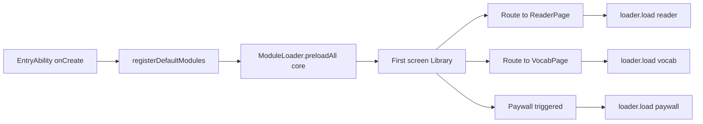
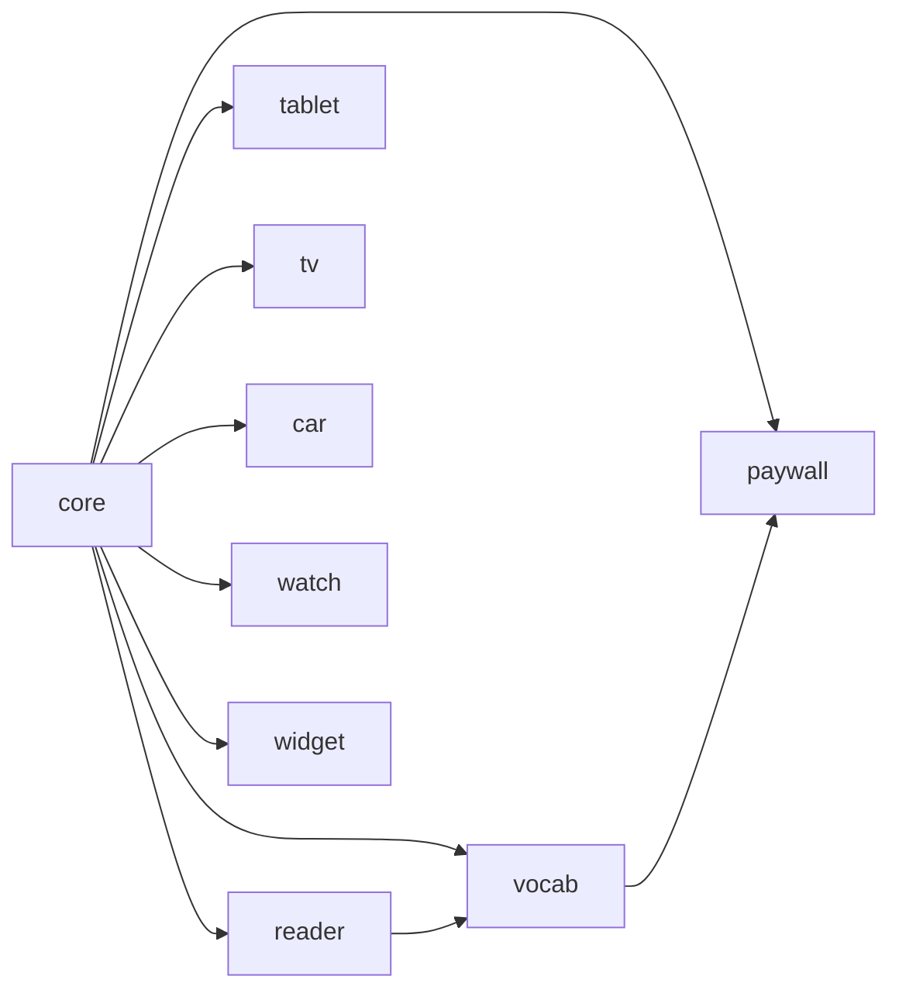

# Bundle split strategy — Readmigo CN HarmonyOS

W20-C4 — split the monolithic entry HAP into one entry HAP plus multiple HSPs / HARs,
loaded on demand to reduce cold-start RAM and shorten time-to-first-screen. This document is
aligned with the 9-module roster in `entry/src/main/ets/service/dynamic/ModuleLoader.ets`
and is the source of truth for the bundle-size budget checked in review CI.

---

## 1. HAP / HSP / HAR relationships (required reading)

| Form | Full name | Install moment | Load mechanism | Use cases |
|------|------|----------|----------|------|
| HAP  | Harmony Ability Package    | Written to disk at app install time | Loaded at process startup | Mandatory entry (entry) + atomic services (atomic) |
| HSP  | Harmony Shared Package     | Ships with the main package, not independently installed | Loaded at runtime on `import`, can be shared across processes | Large business modules, cross-ability shared code |
| HAR  | Harmony Archive            | Linked into callers at compile time | Same binary segment as the caller | Utility libraries, models, pure TS |

**Key takeaways**:

1. The cold-start path only permits entry HAP + core HSP; other modules are loaded via
   `ModuleLoader.load()`, which triggers HSP loading. The HSP has already been pre-decoded
   by the OS into the `.abc` cache, so re-activation takes < 50 ms.
2. Pure logic shared across abilities (e.g. typesetter) is packaged as a HAR so multiple
   HSPs can inline it, avoiding load-order dependencies between HSPs.
3. Atomic-service abilities (W11 LookupAbility and so on) are independent HAPs, separate
   from entry, and bound by the system's ≤ 10 MB hard limit per atomic service.

---

## 2. Boundaries and ownership of the 9 modules

| Module ID | Form | Trigger | Entry API | Anti-examples (don't put here) |
|---------|------|----------|----------|----------------|
| core    | static inside entry HAP | Cold start | EntryAbility / RouteRegistry / Auth | Any business UI |
| reader  | HSP `@readmigo/reader`   | Before entering ReaderPage | TypesetterEngine / SelectionLayer | Dictionary / subscription |
| vocab   | HSP `@readmigo/vocab`    | When entering VocabPage or Flashcard | VocabStore / FlashcardEngine | Reading engine |
| paywall | HSP `@readmigo/paywall`  | Any paywall trigger | PaywallView / IAPService | Business lists |
| tablet  | HSP `@readmigo/tablet`   | When breakpoint ≥ LG | SplitLayout / DragDropController | Phone layout |
| tv      | HSP `@readmigo/tv`       | When launched with runtimeOS=tv | RemoteController / TVOverview | Touch-only pages |
| car     | HSP `@readmigo/car`      | When launched with runtimeOS=car | VoiceCommand / DriverModeView | Background TTS |
| watch   | HSP `@readmigo/watch`    | When launched with runtimeOS=watch | WatchVocabCard / WatchReader | Main app pages |
| widget  | HAR + ExtensionAbility   | When cards / atomic services are loaded | UniversalCardAdapter / FormDataStore | Network SSE |

> Note: HSP names use npm-style scopes so dependency direction can be explicitly declared
> in `oh-package.json5` `dependencies` (preventing reverse references such as reader → paywall).

---

## 3. Per-bundle size budget

Budget origin: after Phase 2 (W10), ArkUI compilation output measured `entry.hap = 31.2 MB`,
which exceeds the HarmonyOS store's recommended 30 MB red line and must be split. The table
below lists target values (via `hvigorw assembleHap`).

| Module | Budget (KB) | Main contents | Pre-split owner |
|------|-----------|--------------|-------------|
| entry HAP (incl. core) | ≤ 4,500 | EntryAbility, routing, Auth, Theme, AppStorage keys | All |
| reader HSP   | ≤ 2,500 | typesetter, paginator, selection, audio sync | entry |
| vocab HSP    | ≤ 1,000 | VocabStore, SRS algorithm, FlashcardPage | entry |
| paywall HSP  | ≤ 700   | PaywallView, IAPService, restore flow | entry |
| tablet HSP   | ≤ 800   | SplitLayout, DragDrop, LG adaptation | entry |
| tv HSP       | ≤ 900   | RemoteController, TVOverview, focus engine | entry |
| car HSP      | ≤ 600   | VoiceCommand, DriverModeView, headset hook | entry |
| watch HSP    | ≤ 500   | WatchVocabCard, WatchReader, complication | entry |
| widget HAR + ExtensionAbility HAP | ≤ 400 | UniversalCardAdapter, FormDataStore, 4 ExtensionAbilities | entry |
| **Cold-start image total** | **≤ 5,000** | entry HAP + mandatory ExtensionAbility | 31,200 |
| **Total install size**   | **≤ 12,000** | All HSPs + HARs unpacked | 31,200 |

> Acceptance criteria:
> - Cold-start image = sum of `du -sb entry/build/.../entry.hap`; the red line is enforced
>   by the PerformanceBudget workflow on every PR.
> - Total install size is measured against the `.app` file uploaded to the store; the
>   HarmonyOS store has a 200 MB hard upload limit.

---

## 4. Loading strategy (aligned with ModuleLoader)

| Module | Trigger hook | Failure fallback |
|------|----------|----------|
| reader  | RouteGuard awaits before Library→Reader | Show "Reader failed to load" + retry button |
| vocab   | Awaited before Library tab switch | Show empty state + retry in background |
| paywall | Awaited before IAPService.beforeShow | Toast "Subscription unavailable, please retry" |
| tablet  | When BreakpointController switches to LG | Degrade to single-column layout |
| tv/car/watch | Awaited synchronously at Ability launch | Launch failure → exit + log |
| widget  | FormExtensionAbility.onAddForm | Show placeholder card |

---

## 5. Cross-module dependency rules

- One-way dependencies: any edge not shown above is forbidden. CI will enable an
  `arkts-dep-check` script in W22 that scans each HSP's `oh-package.json5` and fails
  on reverse references.
- core may not import any HSP; HSPs may not import sibling HSPs (with the two
  exceptions above: reader→vocab and vocab→paywall).
- Atomic-service abilities may depend only on the widget HAR (to avoid packing the
  reader engine into a ≤ 10 MB atomic service).

---

## 6. Rollout milestones

| Phase | Action | Status |
|------|------|------|
| W20-C4 | ModuleLoader + docs + e2e scaffolding | In progress (this iteration) |
| W21    | Migrate reader / vocab / paywall to real HSPs, switch hvigorw packaging | Pending |
| W22    | tablet / tv / car / watch / widget HSPs + CI bundle-size budget check | Pending |
| Post-V1 | Atomic-service ability HAP signed independently, shipped via "install on demand" | Pending |

---

## 7. Verification methods

1. Local: `hvigorw assembleHap --mode product=release`; output lives in
   `entry/build/default/outputs/release/`, with each HSP as a separate `.hsp` file.
2. CI: enable the `bundle-budget` job in W22, compare against the budget table above,
   fail on > 5% overage.
3. Runtime: `ModuleLoader.getAllStatuses()` is exposed in the dev menu; it shows each
   HSP's loadDurationMs and failure count, and feeds into PerformanceBudget telemetry.

---

## 8. Risks and rollback

- HSP loading on HarmonyOS NEXT 5.0 still incurs a 200–400 ms first cold-load delay,
  so reader must be prefetched before the Library→Reader route transition (already
  implemented in RouteGuard).
- If splitting actually makes cold start slower (amplified by IO jitter), the rollback
  strategy is to fold reader back to static-dependency status inside entry HAP, keeping
  only weakly-triggered modules such as vocab / paywall / tablet as HSPs.
- If atomic-service HAP independent signing fails, temporarily attach the card
  ExtensionAbility to the entry HAP (degraded mode) to keep basic cards alive, and
  switch back once signing is fixed.
