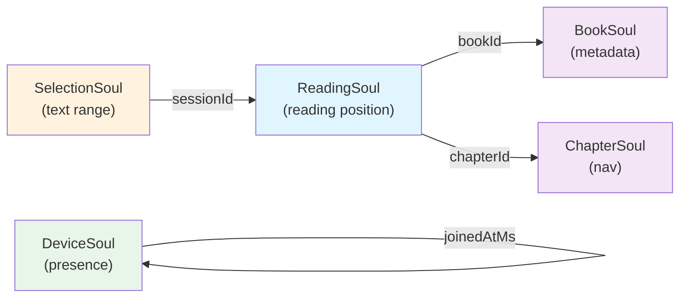
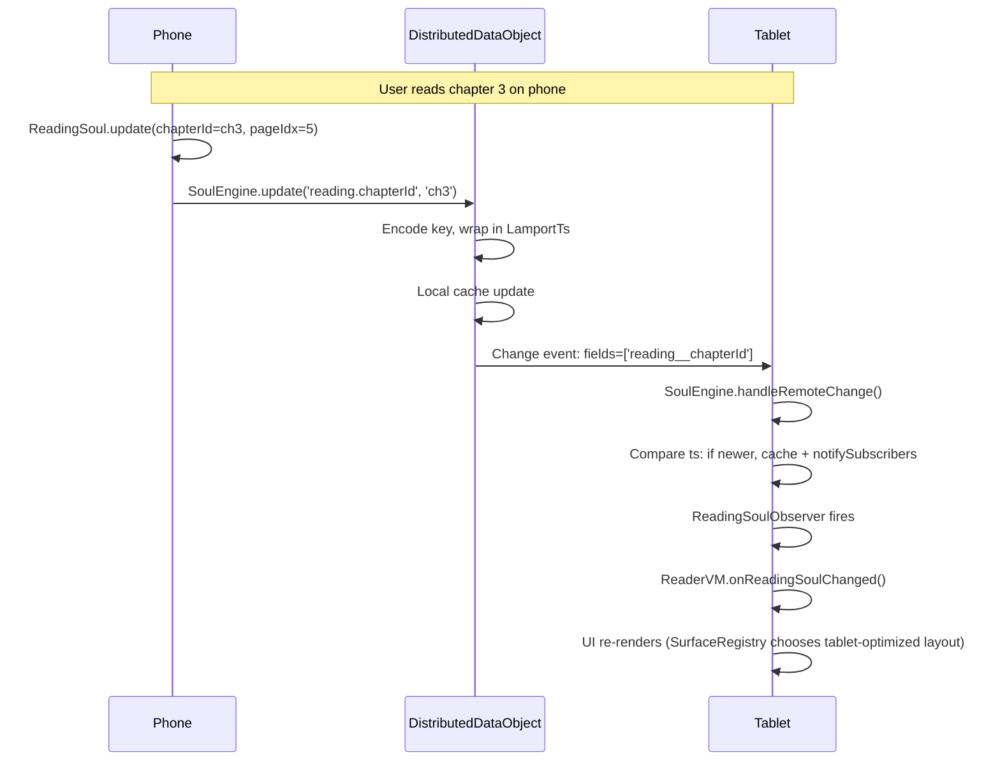
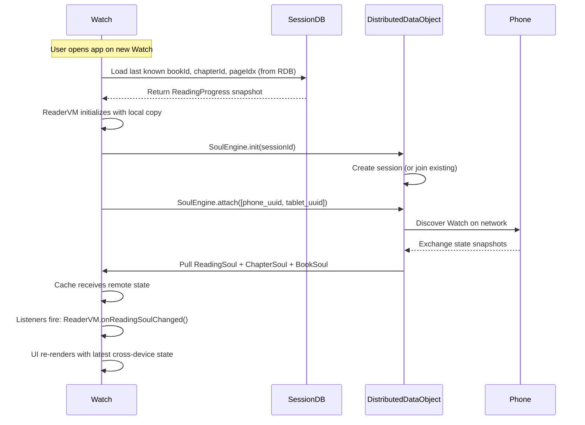

# Distributed Reading Soul (分布式阅读灵魂)

## TL;DR

The **Distributed Reading Soul** is a cross-device reading state synchronization layer that enables seamless continuation of reading progress, selections, and metadata across paired HarmonyOS devices. Unlike iOS (which treats each device as independent), Harmony's distributed data object infrastructure allows a single "soul" instance to propagate changes in real time: when you turn a page on your phone, your tablet and smartwatch learn about it instantly and can offer contextual actions (e.g., "switch to tablet view", "continue from phone"). The Soul is authoritative for cross-device state; local RDB snapshots persist the latest value for resilience.

---

## 1. Data Model

All distributed state is shaped by discriminated-union types defined in `/harmony-app/entry/src/main/ets/core/distributed-soul/SoulSchema.ets`.

### 1.1 Core types

| Type | Purpose | Key fields |
|------|---------|-----------|
| **LamportTs** | Logical timestamp for conflict resolution | `deviceId`, `seq`, `wallClockMs` |
| **ReadingSoul** | Current reading position (chapter, page, character) | `bookId`, `chapterId`, `pageIdx`, `charOffset`, `ts` |
| **BookSoul** | Lightweight book metadata snapshot | `bookId`, `title`, `coverUrl`, `totalChapters`, `ts` |
| **ChapterSoul** | Chapter navigation metadata | `chapterId`, `bookId`, `index`, `title`, `ts` |
| **SelectionSoul** | Optimistic text selection (prefers local on conflict) | `sessionId`, `range: TextRange`, `ts` |
| **DeviceSoul** | Device presence & session membership | `deviceId`, `deviceName`, `platform`, `joinedAtMs`, `ts` |

### 1.2 Entity Relationship Diagram



**Legend:**
- Light blue: primary reading state (authoritative across devices)
- Light purple: metadata snapshots (reference data)
- Light orange: UI-only optimistic state (prefers local on conflict)
- Light green: session/device management

### 1.3 Lamport Timestamp & Last-Writer-Wins

The **LamportTs** triple `(deviceId, seq, wallClockMs)` breaks ties when two devices write conflicting values:

```
isNewer(a, b) = 
  if a.seq > b.seq then true
  else if a.seq == b.seq and a.wallClockMs > b.wallClockMs then true
  else if a.seq == b.seq and a.wallClockMs == b.wallClockMs then a.deviceId > b.deviceId (lexical tiebreak)
  else false
```

**LWW (Last-Writer-Wins) fields**: ReadingSoul, BookSoul, ChapterSoul, DeviceSoul — remote update applied only if newer.

**Optimistic fields**: SelectionSoul.range — local value always preferred; remote updates skipped (ref. `SoulEngine.ets:187`).

---

## 2. Sync Lifecycle

### 2.1 Warm-Link Scenario (devices already paired)

**Assumption**: Both devices are enrolled in the same HarmonyOS account and have Bluetooth/network connectivity.



**Key points:**
- Update is fire-and-forget on phone; no ACK required.
- DistributedDataObject handles serialization & network delivery.
- Tablet's listener is synchronous; mutation of cache & observer notification are same-thread.
- RDB persistence is separate: ReadingProgressRepository.save() fires after Soul.update() succeeds.

### 2.2 Cold-Link Scenario (new device joins mid-session)



**Key points:**
- RDB bootstrap ensures Watch has *something* to display immediately (UX: no blank screen).
- Distributed sync is eventual; by the time Watch.UI re-renders, it has merged phone & tablet history.
- Session ID is stable across devices (derived from user + active book, or hash).

---

## 3. Conflict Resolution

### 3.1 LWW (Last-Writer-Wins) for most fields

When two devices write different values for the same path:

1. Each write includes its own `LamportTs`.
2. Remote change arrives with remote `ts`.
3. Compare `isNewer(remoteTp, localTs)`.
4. Apply remote only if newer; else discard.

**Example conflict:**
- Phone at 10:00:00 writes `pageIdx=5, ts=(phone_id, 100, 10:00:00)`.
- Tablet at 10:00:05 writes `pageIdx=3, ts=(tablet_id, 50, 10:00:05)`.
- Compare: phone.seq (100) > tablet.seq (50) → phone wins, pageIdx remains 5.

### 3.2 Optimistic Local for SelectionSoul.range

Text selection is ephemeral and user-driven. To avoid flickering:

- User selects text on phone → `SelectionSoul.range` = [startChar, endChar].
- If remote tablet sends a stale selection at the same time, **ignore it**.
- Phone's local value persists even if remote is technically "newer" in LamportTs.

(See `SoulEngine.ets:186–187`: `if (path.endsWith('range') && cached) continue;`)

---

## 4. Local Fallback

Not all HarmonyOS devices have the native `@ohos.data.distributedDataObject` API (e.g., emulator, older firmware). The **LocalFallback** pattern ensures caller code does **not branch**.

### 4.1 Pattern

```
SoulEngine.init() 
  → try create distributedDataObject 
  → catch (API unavailable)
    → set dataObj = null, isFallbackMode = true
    → in-memory cache still works
    → subscriptions still fire
    → writes go to cache only (no network sync)
```

### 4.2 Caller invariant

Caller code does **not** check `isFallbackMode`:

```ets
// Caller code — same path for both single-device and multi-device
await SoulEngine.getInstance().update('reading.pageIdx', 5);
// If fallback: cache updated, subscribers notified, no network write.
// If distributed: cache updated, subscribers notified, network propagate.
```

When running on single device or no distributed API:
- RDB persistence layer (ReadingProgressRepository) is the single source of truth.
- Soul cache is warm backup.
- Network sync is no-op (but not error).

---

## 5. Failure Modes

| Failure | Symptom | Recovery |
|---------|---------|----------|
| **One device drops off network** | No new updates arrive on that device; others continue syncing. | Reconnect → catch-up from cache or RDB snapshot. |
| **Network partition (A ↔ B, but B ↔ C isolated)** | B receives both A's and C's writes; A and C diverge. Later, when partition heals, Lamport seq decides the winner. | No resolution needed; LWW rule is deterministic. Next sync resolves to newest seq. |
| **Schema version mismatch** | Unknown fields in remote JSON; `JSON.parse()` tolerates extras. | Graceful: extra fields ignored, known fields parsed. Malformed JSON caught by try-catch. |
| **Oversized payload (>10KB per write)** | DistributedDataObject.update() may reject or fail silently; cache may not receive full data. | Log warning; check payload size before write (see budget § 7). |
| **Device clock skew (wallClockMs unreliable)** | Lamport seq is primary tiebreaker; clock is fallback. Seq monotonically increments per device, so skew is masked. | No mitigation needed; seq is the real tie-breaker. |

---

## 6. Capacity & Budget

### 6.1 Soul payload size

Each distributed write should be ≤ 10 KB to respect the distributed data object's soft limit. Reference: `/harmony-app/docs/performance-budget.md` § 4.

**Budgeting example:**
- ReadingSoul: ~200 bytes (6 fields, all primitives).
- BookSoul: ~800 bytes (title, coverUrl strings).
- SelectionSoul: ~100 bytes (range coordinates).
- DeviceSoul: ~300 bytes (deviceName, platform).
- **Total per write**: ~1500 bytes under budget.

**When to split:**
- If adding a new field (e.g., `bookmarkList`) that would exceed 10KB, move it to a separate soul type or paginate (e.g., read bookmarks in chunks).

### 6.2 Subscription count

Per-session subscriptions should remain < 100 (one per UI observer). Each subscription holds a callback reference; thousands would leak memory.

---

## 7. Migration Path: Soul + RDB Coexistence

### 7.1 Write order

```
ReaderVM.updatePageIdx(5)
  → Soul.update('reading.pageIdx', 5)                    // Fire-and-forget (network async)
  → ReadingProgressRepository.save({...})               // Fire-and-forget (RDB async)
```

Both writes are independent. Soul propagates to siblings; RDB persists locally.

### 7.2 Read path

```
ReaderVM.onReadingSoulChanged(newReading: ReadingSoul)
  → setState({ reading: newReading })
  → UI renders from state
```

If Soul listener doesn't fire (e.g., fallback mode, network delay), RDB acts as bootstrap:
```
ReaderVM.constructor()
  → ReadingProgressRepository.findByBook(userId, bookId)
  → setState({ reading: fromRdb })
  → (later) SoulEngine.subscribe() fires if network syncs
```

### 7.3 Consistency guarantee

Soul is **eventually consistent** across devices. RDB is **strongly consistent** locally. Caller code reads from whichever is fresher:

```ets
const fromRdb = await ReadingProgressRepository.findByBook(userId, bookId);
const fromSoulCache = SoulEngine.getInstance().cache.get('reading.pageIdx');
const actual = fromSoul?.ts.wallClockMs > fromRdb?.updatedAt 
  ? fromSoul 
  : fromRdb;
```

(In practice, ReaderVM uses Soul listener + RDB fallback without explicit merge.)

---

## 8. Testing Plan

### 8.1 Unit tests

**Location:** `/harmony-app/entry/src/ohosTest/ets/test/`

- **SoulEngine.update()**: Verify cache is updated, subscribers notified, Lamport ts is incremented.
- **isNewer()**: All 6 comparison cases (seq, wallClock, deviceId tiebreak).
- **SelectionSoul conflict**: Verify local value persists despite remote newer ts.
- **LocalFallback**: init() without API should set isFallbackMode=true, but all other methods work identically.

### 8.2 Device-pair manual tests (W14 milestone)

- **Warm link**: Read chapter on phone → confirm tablet receives update within 1s.
- **Cold link**: Start reading on phone; open tablet → tablet boots from RDB, syncs from phone within 2s.
- **Partition heal**: Toggle WiFi on tablet while reading on phone → tablet catches up after reconnect.
- **Selection sync**: Long-press text on phone → tablet receives SelectionSoul.range; phone's local selection persists even if tablet sends stale value back.

---

## 9. Related Documentation

- **ARCHITECTURE.md**: Layer contract and cross-feature rules.
- **layer-contract.md**: L1 Foundation rules for DistributedSoul (when available).
- **intent-contract.md**: How ReaderVM publishes ReadingSoulChanged intents to UI.
- **performance-budget.md**: Soul payload ≤ 10KB, subscription count < 100.
- **bundle-strategy.md**: distributedDataObject API size footprint.
