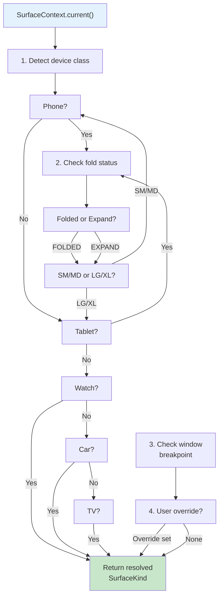

# Adaptive Surface Decomposition (自适应表面分解)

## TL;DR

**Adaptive Surface Decomposition** is an architectural pattern that separates business logic (ViewModel) from device-specific rendering. Instead of one feature having one UI, each feature decouples into a single **ViewModel** (state machine + intents) and **five renderers**, one per surface: Phone (full-screen pages), Tablet (side-by-side layouts), Watch (glanceable cards), Car (voice + minimal UI), and TV (large-text accessible views). The runtime **SurfaceRegistry** decides which renderer to activate based on device class, fold state, and window breakpoint. This eliminates cross-feature branching (`if (kind === Phone)` in shared code) and enables each surface team to optimize UX independently.

---

## 1. Surface Roster

Five **SurfaceKind** values categorize HarmonyOS device form factors and interaction modalities:

| SurfaceKind | Example devices | Screen size | Interaction | Typical layout | Ability entry |
|------|------|------|------|------|------|
| **Phone** | P70, Mate 70S | SM / MD (~6") | Touch, gesture | Full-screen page stack | ReaderAbility |
| **Tablet** | MatePad 13", Pro 12" | LG / XL (≥10") | Touch, stylus, keyboard | Master-detail / split-pane | Multi-window (system) |
| **Watch** | Watch 5, Watch Ultra | XS (<2") | Rotary, swipe | Card, glance, chart | WatchAbility |
| **Car** | Polestar, BMW iX | 10"+ (Head Unit) | Voice, steering wheel buttons, occasionally touch | Minimal text, icons, waveform | CarAbility |
| **TV** | Honor Vision, Huawei TV | XL (55"–85") | Remote, voice | Large text, big buttons, 大字版 (accessibility) | SmartScreenAbility |

---

## 2. Resolution Algorithm

The **SurfaceContext** determines which renderer fires. Decision tree:



**Details:**
1. **Device class** (rom from `@ohos.deviceInfo`): If `deviceType === 'phone'` → Phone surface; if `tablet` → Tablet, etc.
2. **Fold state** (from Breakpoints.ts): If foldable device, check `FoldStatus.FOLDED` vs `EXPAND`; re-evaluate breakpoint.
3. **Window breakpoint** (from AppStorage.app_breakpoint): Phone SM/MD, Tablet LG/XL, Watch XS, Car/TV context-dependent.
4. **User override** (from SettingsStore): User can force "view as Tablet" on a phone for accessibility.

**Result**: A deterministic **SurfaceKind** enum value, which indexes into SurfaceRegistry to fetch the active renderer.

---

## 3. Renderer Contract

A **Renderer** is a pure function: `(state: T) => Builder`. It receives immutable state and returns ArkUI Builder.

### 3.1 Allowed

- Read state fields (any, including nested).
- Emit **Intents** to the IntentBus (user interactions).
- Call **@ohos.display**, **@ohos.window** (device info, breakpoints).
- Compute layout parameters from state (e.g., column count based on breakpoint).
- Render sub-components (recursively, within reason).

### 3.2 Forbidden

- Mutate state or intent objects.
- Call service/API directly (e.g., `http.request()`). State flows through ViewModel.
- Depend on sibling surfaces (no imports from `surfaces/tablet/` if you're in `surfaces/phone/`).
- Conditional logic like `if (SurfaceKind.Phone) { ... }` inside shared renderer. If logic diverges, split renderers.
- Call `@ohos.router` directly; use IntentBus to signal navigation.

### 3.3 Example: Phone reader renderer

```ets
export class PhoneReaderRenderer {
  static render(state: ReaderState): Builder {
    return () => {
      Stack() {
        // Content
        Text(state.chapterTitle)
          .fontSize(18)
        ReaderPageView({ content: state.pageContent })
        
        // Intent: page turn
        GestureDetector()
          .onSwipe((_direction: SwipeDirection) => {
            IntentBus.emit(new TurnPageIntent(1));
          })
      }
    };
  }
}
```

(No branching; no state mutation; no service calls.)

---

## 4. Per-Feature Example: Reader

### 4.1 Feature structure

```
features/reader/
  ├── index.ets                  (barrel)
  ├── service/
  │   ├── ReaderVM.ets          (ViewModel: state machine + intents)
  │   └── ReadingSession.ets      (session management)
  ├── pages/
  │   └── Reader.ets            (Phone surface root)
  ├── components/               (shared sub-components)
  │   ├── ReaderPageView.ets
  │   ├── SelectionLayer.ets
  │   └── HighlightLayer.ets
  └── adapters/                 (per-surface renderers)
      ├── PhoneReaderRenderer.ets
      ├── TabletReaderRenderer.ets
      ├── WatchReaderRenderer.ets
      ├── CarReaderRenderer.ets
      └── TvReaderRenderer.ets
```

### 4.2 Sequence: OpenBookIntent → UI render

```
User taps "Continue Reading" on Library page
  ↓
LibraryVM emits OpenBookIntent(bookId=123)
  ↓
IntentBus routes to ReaderVM
  ↓
ReaderVM.onOpenBook(bookId=123)
  → Fetch chapter content (async)
  → Fetch ReadingSoul progress
  → setState({ book, chapter, pageContent, ... })
  ↓
ReaderState subscriber fires (ALL surfaces notified simultaneously)
  ↓
SurfaceRegistry.resolve(currentContext)
  → Detect: Phone + SM breakpoint → PhoneReaderRenderer
  → Detect: Tablet + LG breakpoint → TabletReaderRenderer
  → Detect: Watch + XS breakpoint → WatchReaderRenderer
  ↓
Respective renderer.render(state) → Builder
  ↓
ArkUI renders full-screen pages (Phone), side-by-side master-detail (Tablet), glance card (Watch)
```

### 4.3 Multi-surface rendering

**Phone renderer** (full-screen sequential pages):
```
┌─────────────────────┐
│  Chapter 3: Intro   │
├─────────────────────┤
│ [Full page text]    │
│ ...                 │
│ ...                 │
├─────────────────────┤
│ ← 45/250 →  Settings│
└─────────────────────┘
```

**Tablet renderer** (side-by-side):
```
┌──────────────────────────────────────────┐
│ ┌────────────────┐ ┌──────────────────┐  │
│ │  TOC           │ │ Chapter text     │  │
│ │  Chapter 1     │ │ (full-width      │  │
│ │  Chapter 2     │ │  justified)      │  │
│ │  ► Chapter 3   │ │ ...              │  │
│ │  Chapter 4     │ │ ...              │  │
│ └────────────────┘ │ ...              │  │
│                    │                  │  │
│                    │ Settings ▼ Marks │  │
│                    └──────────────────┘  │
└──────────────────────────────────────────┘
```

**Watch renderer** (glance card):
```
┌────────────────┐
│ Reading        │
│ Chapter 3      │
│ ▓▓▓▓░░░ 45%   │
│ ⊕ Bookmark    │
│ ◎ Highlight   │
└────────────────┘
```

**Car renderer** (voice-primary, minimal UI):
```
Playing: Chapter 3
Progress: 45 min / 120 min

[Prev] [Play/Pause] [Next]
Voice: "Continue reading Chapter 3..."
```

**TV renderer** (大字版 — accessibility):
```
┌─────────────────────────────────┐
│  Chapter 3: The Long Journey    │
├─────────────────────────────────┤
│  [Very large text, 32pt]        │
│  ...                            │
│  ...                            │
├─────────────────────────────────┤
│  [Large buttons]  < Prev │ Next >│
│  Progress:  ████░░░  45%         │
└─────────────────────────────────┘
```

All five renderers subscribe to the **same ReaderState**. When state changes, all update simultaneously (or are garbage-collected if not visible).

---

## 5. Breakpoints & Reflow

**Reference**: `/harmony-app/entry/src/main/ets/core/theme/Breakpoints.ets`

### 5.1 Breakpoint enum

```ets
export enum Breakpoint {
  XS = 'xs',  // <320vp
  SM = 'sm',  // 320–519vp
  MD = 'md',  // 520–839vp
  LG = 'lg',  // 840–1279vp
  XL = 'xl',  // ≥1280vp
}
```

### 5.2 UI reflow on rotation

```
Phone in portrait (SM) reads Chapter 5
  ↓ User rotates to landscape (MD)
  ↓ Breakpoints.ets fires windowSizeChange listener
  ↓ AppStorage.app_breakpoint = 'md'
  ↓ ReaderState remains unchanged
  ↓ PhoneReaderRenderer.render() re-invokes
  ↓ Layout recalculates columns, font size, margins per 'md'
  ↓ ArkUI re-renders (smooth animation if configured)
```

No state churn; no ViewModel reload; pure UI recalculation.

### 5.3 Fold state transitions

Foldable device (e.g., Mate X5):

```
Folded (outer screen, SM breakpoint)
  ↓ User opens to Half-Folded (hover angle, MD breakpoint)
  ↓ Listeners fire, breakpoint updates, renderer re-renders
  ↓ Expanded (full inner screen, LG breakpoint)
  ↓ Renderer switches to tablet-like layout
```

The same renderer may reflow 3 times in 2 seconds; all changes are driven by state & breakpoint, not hardcoded surface checks.

---

## 6. State Sharing Across Surfaces During Continuation

### 6.1 Continuation (atomic launch) flow

User reading on phone, opens on tablet via Continuation:

```
Phone: ReaderVM initialized, state = { book=123, chapter=5, pageIdx=100, ... }
  ↓ User swipes down (gesture for "open on other device")
  ↓ ContinuationManager.request() → Atomic framework
  ↓
Tablet: EntryAbility launched with continuation hint
  ↓ ReaderVM on tablet reads continuation data (bookId=123, chapterId=5)
  ↓ Fetches state snapshot from DistributedSoul (or RDB fallback)
  ↓ ReaderVM.setState({ book=123, chapter=5, pageIdx=100, ... })
  ↓
SurfaceRegistry.resolve(tablet context) → TabletReaderRenderer
  ↓
Tablet renders side-by-side layout with identical state
```

**Key invariant**: State is **preserved** across devices; only the renderer changes.

---

## 7. Anti-Patterns

Developers WILL attempt these; **forbid them**:

| Anti-Pattern | Why forbidden | Correct approach |
|---|---|---|
| **Per-surface fork of feature code** (separate ReaderVM for phone vs tablet) | Violates the ViewModel-once principle; doubles maintenance, causes state divergence. | One ReaderVM + five renderers. |
| **ArkUI import in ViewModel** (e.g., `import { router }` in ReaderVM) | ViewModel must be platform-agnostic; mixes UI layer into state machine. | Emit Intent; IntentBus routes to Navigator. |
| **Conditional `if (kind === Phone)` inside shared renderer** | Couples renderer to other surfaces; defeats the purpose of decoupling. | Split into separate `PhoneReaderRenderer` and `TabletReaderRenderer`. |
| **Service calls from inside `build()`** (e.g., `http.get()` in a Text's onClick) | Blocks rendering; unbounded latency; loses error handling. | Emit Intent → ViewModel → service call → setState. |
| **Mutating Intents after publish** (e.g., `intent.pageNum = 2` after `IntentBus.emit()`) | Intent is immutable signal; mutation breaks concurrent renderers. | Emit new intent if state change needed. |

---

## 8. Adding a New Surface

If adding a new surface (e.g., **Fridge Display** in 2027):

1. **Add enum value** to `SurfaceKind`:
   ```ets
   export enum SurfaceKind {
     Phone, Tablet, Watch, Car, TV, Fridge // ← new
   }
   ```

2. **Implement detector** in `SurfaceContext.current()`:
   ```ets
   if (deviceType === 'fridge') return SurfaceKind.Fridge;
   ```

3. **Create renderers** in each feature:
   ```
   features/reader/adapters/FridgeReaderRenderer.ets
   features/library/adapters/FridgeLibraryRenderer.ets
   ...
   ```

4. **Register with SurfaceRegistry**:
   ```ets
   SurfaceRegistry.register(
     SurfaceKind.Fridge,
     ReaderFeature.createFridgeRenderer()
   );
   ```

5. **Test**: Run on fridge simulator or physical device; verify all features render.

**No code duplication; no ViewModel changes; no cross-feature branching.**

---

## 9. Related Documentation

- **ARCHITECTURE.md**: Layer contract and feature structure.
- **layer-contract.md**: L2 Surface rules (when available).
- **intent-contract.md**: How renderers emit & subscribe to Intents.
- **distributed-soul.md**: Cross-device state propagation (complement to Surface).
- **Breakpoints.ets**: Breakpoint enum and detection logic.

---

## Glossary

- **SurfaceKind**: Enum discriminating device form factors (Phone, Tablet, Watch, Car, TV).
- **SurfaceContext**: Runtime detector determining active SurfaceKind.
- **SurfaceRegistry**: Singleton mapping SurfaceKind → Renderer implementations.
- **Renderer**: Pure function `(state: T) => Builder` producing ArkUI output.
- **ViewModel**: State machine + intent handler; shared across all surfaces.
- **Breakpoint**: Window-size category (XS–XL) driving responsive layout.
- **Continuation**: HarmonyOS Atomic framework for handing off app state between devices.
- **Intent**: Immutable event published by renderer to signal user action.
- **IntentBus**: Central pub-sub for Intent routing (L2 Foundation).
